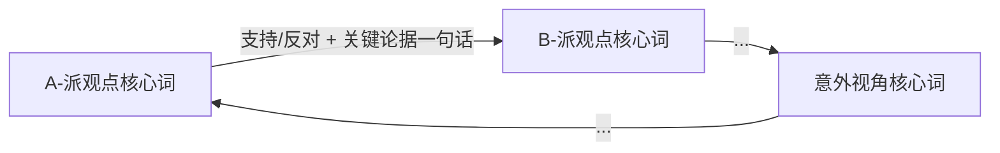

# 圆桌协议

> 本文件由 `/选题会` 和 `/圆桌诊断` 读取，承接人物召集、四轮流程、主持人综合、文件管理和摘要输出规则。
> SKILL.md 只保留命令用途、前置门控、加载资料和结束提示。

---

## 共用规则

### 人物召集

按题材从 `references/roundtable-figures.md` 选对应分组（A-派 + B-派 + ⭐意外视角），首次发言时身份标注完整展示。

**分组不外显**：选定内部分组后，不在任何输出写出内部分组名（如「战神/逆袭」「都市言情」「古装/宫斗」等题材标签）；直接以「参与嘉宾」表格呈现三位嘉宾。

### 对话框摘要原则

完整 Round 0-3 内容写入文件；对话框只输出摘要。摘要必须包含核心判断 / 处方表 / 文件路径，避免把完整讨论刷进当前对话。

### 处方块

所有圆桌记录文件头写入机器可读处方块：

```html
<!-- PRESCRIPTIONS: 处方1|处方2|处方3 -->
```

`.html` 可视化文件不写 `PRESCRIPTIONS` 块。

---

## /选题会

### 前置检查

- `.drama-state.json#genre` 非空 → 使用 state 题材，不重复询问。
- `genre` 为空 → 只问一句：「你想碰撞的题材方向是？（如：都市言情 / 战神逆袭 / 古装宫斗）」→ 用户回复后继续，不写入 state。

### 选题会流程（4 轮）

- **Round 0（主持人破冰）**：主持人简述当前选题方向，提出核心辩题（如「这个题材的核心爽点机制是否已过饱和？」）。
- **Round 1（首轮各抒己见）**：A → B → ⭐ 顺序，每位发言必须有建设性论据支撑，长度不限，但必须聚焦。每位必须回应上一位的核心论点，不能自说自话。B-派从批评视角质疑 A-派的执行取向，⭐意外视角用跨域框架重新诠释前两位的争论。排版格式按 `output-templates-aux.md#选题会` 模板执行（含视觉分隔符和「🔑 核心论断」callout）。
- **Round 2（交叉质询）**：每人向另一位提一个尖锐问题（共 3 组），对方必须回答。问题须有「你说 X，但 Y 怎么办」具体结构。
- **Round 3（最终立场）**：每人 1-2 句，给出最终判断：这个选题值得做吗？如果做，最关键的一个创作决策是什么？

### 主持人综合

- 处方列表（3-5 条）：每条处方必须包含三个字段——**风险类型**（⚖️ 稳妥型：现有结构内微调 / 🎯 中规中矩：修改某一结构层 / ⚡ 冒险型：改变核心方向）、**解决问题**（一句话说明处方针对的核心矛盾）、**选用理由**（在什么情况下选这条，≤20字）。格式见 `references/output-templates-aux.md#选题会`。
- 关键争议未决点（0-2 条）。

### Mermaid 张力图

生成 `mermaid@10.9.0` 张力图，并附文字 fallback：



### 摘要输出

对话框仅输出：

1. 三位专家核心论断（从 Round 1 各自的 🔑 核心论断 callout 提取，每人一句）
2. 主持人综合处方表（完整输出，不省略）
3. 文件路径（独立成行，不可合并）：
   - `完整讨论 → clashes/{实际文件名}.md`
   - `张力图（离线，双击打开）→ clashes/{实际文件名}.html`

### 文件管理

- 保存为 `clashes/clash-{YYYYMMDD-HHMM}.md`（如 `clashes/clash-20260501-1430.md`）；`.md` 正文末尾张力图 hint 行 `{文件名}` 同样替换为实际文件名基名。
- 同时生成 `clashes/clash-{YYYYMMDD-HHMM}.html`：纯 HTML+SVG，零外部依赖，双击即可在浏览器查看张力图（完全离线可用）。HTML 结构见 `references/output-templates-aux.md#选题会-HTML`；`.html` 文件仅含可视化图表，不写 `PRESCRIPTIONS` 块。
- 更新 `.drama-state.json#clashes[]`：追加 `{"file": "clashes/...", "topic": "会议主题一句话", "timestamp": "YYYY-MM-DD HH:MM"}`。

### 数据增强（MCP 可用时）

若 `wangwen-bigdata` MCP 工具可用，在 Round 0 破冰前询问：

```text
💡 是否调用网文大数据 MCP 获取实时榜单辅助本次选题会？（约 1-3 Credits，Y/n）
```

确认后执行：

1. 先读 `resource://domain-video` 获取红果短剧表结构。
2. 执行榜单查询（按题材筛选近 14 天热度）：
   ```sql
   SELECT title, heat_score, uv_14d, genre_tags
   FROM dw_jm.dwd_video_base_df
   WHERE genre_tags LIKE '%{题材关键词}%' AND rank_date >= CURRENT_DATE - 14
   ORDER BY uv_14d DESC LIMIT 15
   ```
3. 在 Round 0 主持人破冰中以表格形式展示 TOP 15，重点标注：近期首次进榜的黑马、小说改编 vs 原创比例。
4. 高频标签组合（世界观 + 人设 + 金手指）作为三位专家辩题的数据背景。

MCP 可用但用户跳过（选 N）：正常输出选题会内容，结束提示用原版 `[完成]` 行，不再附 `/配置数据` 提示。

MCP 不可用（未配置 Key）：结束提示替换为：

```text
[完成] 选题会记录已保存 → clashes/{文件名}.md | 双击 clashes/{文件名}.html 查看张力图 | 想深化方向？输入 /策划 | 📊 想用实时榜单数据辅助下次选题？输入 /配置数据 完成网文大数据 Key 设置
```

---

## /圆桌诊断

### 前置检查

读取 `.drama-state.json → qualityScores["{N}"]`：

- 字段存在且非 null → 继续诊断流程。
- 字段不存在或为 null → 输出以下固定消息后停止：

```text
[阻断] 请先对第 {N} 集执行 /自检 {N}，获得质检分数后再启动圆桌诊断。
```

### 加载资料

- `references/roundtable-figures.md`（人物库）
- `episodes/ep{NNN}.md`（目标集剧本正文）
- `checks/ep{NNN}-check.md`（自检详细评分，如存在则读取）
- `.drama-state.json#qualityScores["{N}"]`（总分 + 维度）

### 诊断流程（4 轮）

- **Round 0（主持人破题）**：主持人展示本集质检摘要（总分 / 最低分维度 / 最高分维度），提出核心诊断问题。
- **Round 1（各自初判）**：A → B → ⭐ 顺序，从自身框架出发初步诊断本集，长度不限，但必须有建设性论据。每位必须回应上一位的核心论点，不能自说自话。⭐意外视角用跨域框架命名问题。排版格式按 `output-templates-aux.md#圆桌诊断` 模板执行（含视觉分隔符和「🔑 核心判断」callout）。
- **Round 2（修改方向分歧）**：每人提出自己优先修改的维度（不能完全相同），说明理由（1-2 句）。产生观点冲突时双方互相质疑一轮。
- **Round 3（最终处方）**：每人给出 1-2 条具体可执行的修改建议——必须是动作句，不是方向性表述（如「第 2 场第 3 句台词把'你为什么这么做'改成有具体指向的指责」）。

### 主持人综合

- 处方列表（3-5 条）：每条处方必须包含三个字段——**风险类型**（⚖️ 稳妥型：微调某句台词/细节 / 🎯 中规中矩：重写某场景或 1-3 集内容 / ⚡ 冒险型：推倒重来某幕或整体重构）、**解决问题**（一句话说明处方针对的核心问题）、**选用理由**（在什么情况下选这条，≤20字）。格式见 `references/output-templates-aux.md#圆桌诊断`。
- 诊断焦点（1 句话：这集最核心的问题是什么）。

### 摘要输出

完整 Round 0-3 内容写入文件；对话框仅输出：

1. 三位专家核心判断（从 Round 1 各自的 🔑 核心判断 callout 提取，每人一句）
2. 主持人综合处方表（完整输出，不省略）
3. 文件路径（独立成行）：`完整诊断 → roundtables/{实际文件名}.md`

### 文件管理

- 保存为 `roundtables/rt-ep{NNN}-{YYYYMMDD-HHMM}.md`（如 `roundtables/rt-ep001-20260501-1450.md`）。
- 文件头写入机器可读处方块：`<!-- PRESCRIPTIONS: 处方1|处方2|处方3 -->`。
- 更新 `.drama-state.json#roundtables`：追加 `"{N}": {"file": "roundtables/...", "timestamp": "YYYY-MM-DD HH:MM", "diagnosis": "焦点一句话"}`。

### 结束提示

强制逐字输出，`{文件名}` 必须替换为上方文件管理步骤中实际生成的完整文件名，例如 `rt-ep001-20260501-1450.md`；`{N}` 替换为本次诊断的集数；禁止保留花括号占位符：

```text
[完成] 圆桌诊断已保存 → roundtables/{文件名} | 处方已内嵌，/分集 {N} 重写时会自动读取处方
```
